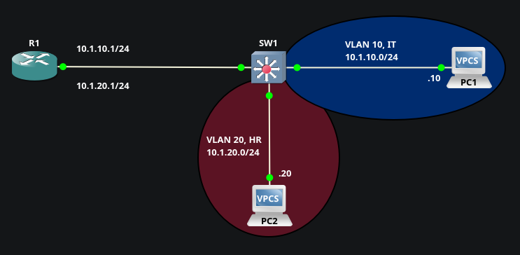
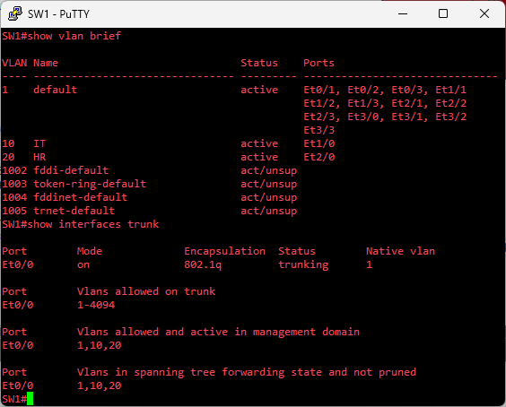
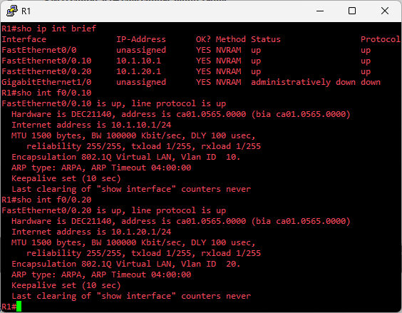
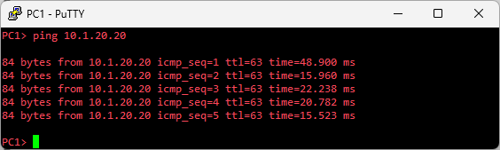

# Inter-VLAN Routing / Router-on-a-Stick

## Objective
Implement & verify traffic flow between VLANs across a single trunk link, utliizing ROAS for inter-VLAN routing

## Topology

## Key Concepts / Overview
Since VLANs isolate themselves into separate L2 broadcast domains, they require routing from a L3 device in order to communicate w/ each other. A trunk configured on the R1-SW1 link permits traffic from multiple VLANs. Inter-VLAN routing requires sub-interfaces w/ VLAN-specific IPs to be configured on R1 for each VLAN  

Sub-interfaces are logical divisions created on a single physical interface. They are dependent on the physical interface for their operational state

## Configuration Breakdown
**SW1**  
* Create VLANs 10 & 20
* Assign access ports ot the appropriate VLANs
* Configure the port connected to R1 as a dot1q trunk  

[SW1 Config](./configs/SW1_Config.txt)

**R1**  
* Configure the physical interface to SW1 (no IP, no shutdown)
* Create sub-interfaces for each VLAN
* On each sub-interface: apply dot1q encapsulation w/ matching VLAN tag, assign an IP address from the VLANs subnet, & ensure no shutdown  

[R1 Config](./configs/R1_Config.txt)

## Verification & Testing
**SW1**  
  
`show vlan [brief]` verifies VLANs & assigned ports (omits trunk port)  
`show interfaces trunk` confirms trunk port & allowed VLANs  

**R1**  
  
`show ip int brief` verifies sub-interfaces, their assigned IP addresses, and that their parent interface is up/up  
`show int f0/0.10` and `show int f0/0.20` confirms sub-interfaces have been dot1q encapsulated & specify their respective VLAN  

**PC1 to PC2 Ping Test**  

## Key Takeaways
**Advantages of ROAS**  
- Single physical link reduces cabling/hardware needs, which lowers cost in small networks or labs/testing environments  
- Quick to set up w/ basic router or switch; ideal when you don't have, or can't justify dedicated Layer 3 hardware  
- Well-suited for small-scale or branch-office scenarios where budget & simplicity are priorities  

**Limitations of ROAS**  
- Single trunk link acts as a bottleneck & single point of failure. If the link or router fails, all inter-VLAN traffic stops  
- In higher-traffic situations, the router can see increased CPU load from handling traffic across multiple sub-interfaces
