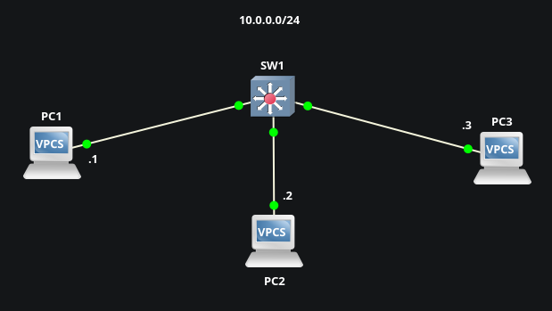

# Port Security Violation Modes (Protect, Restrict, Shutdown) & Errdisable Auto-Recovery
This lab demonstrates Layer 2 port hardening by configuring & contrasting the three violating actions, then automating recovery from shutdown events

## Objective
* Configure & describe the three different port-security violation modes
* Configure & demonstrate automatic err-disabled state recovery caused by port-security violations
* Simulate violations for each switchport & verify with show command outputs
* Compare behaviors of protect, restrict, & shutdown modes in response to MAC violations

## Topology

## Port Security Violation Modes Overview
| Protect | Restrict | Shutdown(default) |
|:---|:---|:---|
| Drops frames from unauthorized MACs silently (no logs, no counter increment, port stays up); minimal disruption | Drops unauthorized frames, increments violation counter, generates logs/SNMP traps, port stays up; good for monitoring without downtime| Places port in err-disabled state immediately upon violation; highest security, requires recovery (automatic or manual) |

## Initial Setup
* Enable port-security for interface range e0/1 - 3, learn MAC addresses dynamically, and set maximum MAC to 1[default]  
`SW1(config)# interface range e0/1 - 3`  
`SW1(config-if-range)# switchport port-security`  
`SW1(config-if-range)# switchport port-security mac-address sticky`  
`SW1(config-if-range)# switchport port-security maximum 1`  

* Alternative to dynamic/sticky: Statically assign each switchport to their respective PC  
`SW1(config-if)# switchport port-security mac-address 0050.7966.6800`

* Optional: Configure e0/1 for shutdown[default] violation mode [PC1]  
`SW1(config-if)# switchport port-security violation shutdown`

* Configure e0/2 for protect violation mode [PC2]  
`SW1(config-if)# switchport port-security violation protect`

* Configure e0/3 for restrict violation mode [PC3]  
`SW1(config-if)# switchport port-security violation restrict`

* Enable automatic err-disable state recovery for 30sec intervals  
`SW1(config)# errdisable recovery cause psecure-violation`  
`SW1(config)# errdisable recovery interval 30`

[SW1 config](./configs/SW1-config.txt)

## Procedure
1. From one PC, ping the other two to populate SW1s MAC table (confirms sticky learning)

2. Disconnect & swap cables from each PC (ex: move PC2 cable to e0/1, etc.) to introduce unknown MACs

3. Attempt pings from each PC & observe results per violation mode

## Verification

### Before violation:

### After violation:
**Shutdown Violation**  

**Restrict Violation**  
  

* Protect violations will have no change in counters/logs, but pings will fail to/from unauthorized MAC

## Troubleshooting & Recovery
To manually recover err-disabled ports, use `shut / no shut` on the err-disabled interface

To recovery automatically, wait 30 seconds

If the unauthorized device remains connected, the port will err-disable again upon the next violation frame. For successful re-ping, reconnect the original authorized MAC (or clear/relearn sticky if needed)

## Notes

Static secure MACs appear in `show mac address-table secure`; dynamic/sticky MACs appear in `show mac address-table [dynamic]` (and sticky in running-config), but not in the secure table  

Sticky MACs are not saved if not written to config. When a port-security interface dynamically learns a MAC using the sticky keyword, it is stored in running-config  

In production, typically use `switchport port-security maximum 2` for phone + PC scenarios, and/or aging timers

## Key Takeaways
* Port security violation modes offer trade-offs between security strength & operational impact - protect for low-visibility environments, restrict for monitored access, shutdown for strict enforcement
* Automatic errdisable recovery reduces manual troubleshooting time in environments with occasional legitimate device changes

