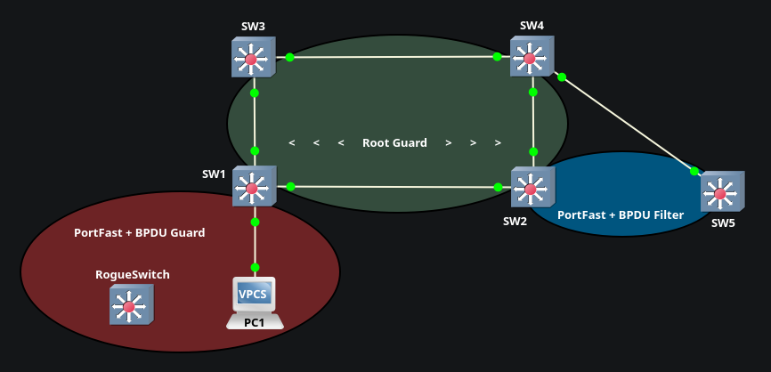

# STP Security Features (PortFast, BPDU Guard, BPDU Filter, Root Guard)

## Objective
Configure, verify, & demonstrate key STP security features (PortFast, BPDU Guard, BPDU Filter, Root Guard) to protect the spanning-tree topology from common misconfiguration & attacks, including unauthorized devices, rogue root bridges, & potential loops

## Topology

