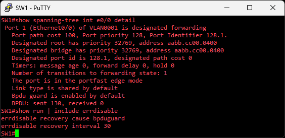
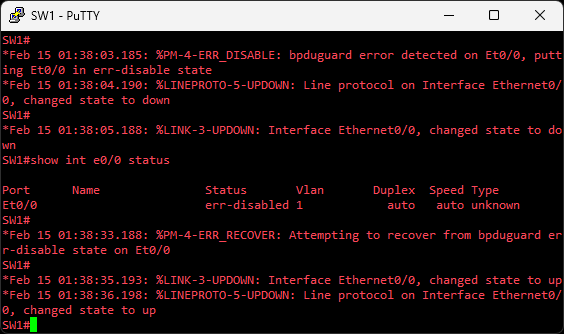
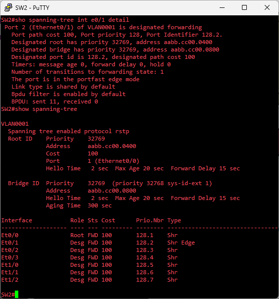
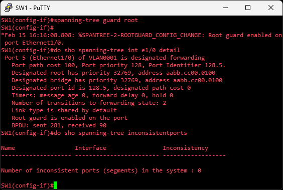
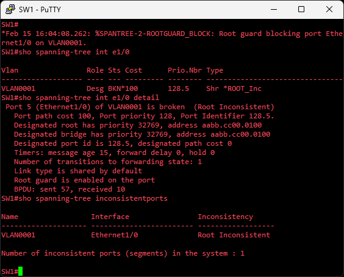

# STP Security Features (PortFast, BPDU Guard, BPDU Filter, Root Guard)
This lab demonstrates four key STP security features using a single GNS3 topology

## Objective
Configure, verify, & demonstrate key STP security features (PortFast, BPDU Guard, BPDU Filter, Root Guard) to protect the spanning-tree topology from common misconfigurations & attacks, including unauthorized devices, rogue root bridges, & potential loops

## Topology

## STP & Security Features Overview
STP is used to prevent loops & other problems by placing certain ports in a blocking state when switches are connected in a way that introduces a physical loop  

| Feature          | Purpose                                                                 | Typical Location             | Config Method(s)                     | Trigger Action / Behavior                                      |
|------------------|-------------------------------------------------------------------------|------------------------------|--------------------------------------|----------------------------------------------------------------|
| **PortFast**         | Speeds up access port convergence by skipping listening/learning states | Access/edge ports            | Per-interface or global default      | N/A (enables fast transition)                                  |
| **BPDU Guard**       | Prevents loops by err-disabling ports receiving unexpected BPDUs       | Access ports (with PortFast) | Global (default on PortFast) or per-interface | Err-disable on BPDU receipt                                    |
| **BPDU Filter**      | Suppresses BPDUs for STP isolation                      | Access ports                 | Global (default on PortFast) or per-interface | Self-disables on BPDU receipt (global); persistent ignore (per-interface) |
| **Root Guard**       | Prevents inferior switches from becoming root by blocking superior BPDUs | Designated/uplink ports      | Per-interface only                   | Places port in root-inconsistent (blocking-like) state         |

## 1. PortFast + BPDU Guard

### Objective
* Demonstrate per-interface PortFast edge configuration combined w/ global BPDU Guard (enabled on PortFast ports via default), verify operational state, simulate an unauthorized switch connection to trigger err-disable, & verify recovery

### Initial Setup
* Enable PortFast per-interface  
`SW1(config-if)# switchport mode access`  
`SW1(config-if)# spanning-tree portfast edge`  

* Enable BPDU Guard globally  
`SW1(config)# spanning-tree portfast edge bpduguard default`  

* Enable automatic err-disable recovery for BPDU Guard every 30 seconds  
`SW1(config)# errdisable recovery cause bpduguard`  
`SW1(config)# errdisable recovery interval 30`  

**Verify Baseline**  
  
* `The port is in the portfast edge mode` means it was enabled per-interface, omitting the default keyword  
* `Bpdu guard is enabled by default` means it was enabled globally, per the default keyword  

### Procedure
Introduce the RogueSwitch device (all default settings) & observe how SW1s e0/0 port enters an err-disable state. BPDU Guard will keep the port err-disabled as long as it continues to receive BPDUs. Disconnect rogue device & wait for automatic err-disable recovery  

**Verify Procedure**  
  

### Notes / Observations
* Err-disable state can be recovered automatically by waiting for the configured interval timer, or manually recovering using shut/no shut on the interface  
* Global BPDU Guard simplifies deployment on many ports while per-interface PortFast allows granular control  
* PortFast + BPDU Guard prevents accidental or malicious switch connections from causing loops or unwanted STP topology changes on access ports  
* Per-interface configs override or take priority over those configured with the default keyword (global)  

## 2. PortFast + BPDU Filter
### Objective
* Demonstrate how a globally configured BPDU Filter automatically self-disables when an STP-speaking device connects, allowing normal STP operation while maintaining PortFast benefits on legitimate end devices  

### Initial Setup
* Enable PortFast per-interface on SW2 e0/1

* Enable BPDU Filter globally  
`SW2(config)# spanning-tree portfast edge bpdufilter default`  

**Verify Baseline**  
  
* Note the `Bpdu filter is enabled by default` line of output, meaning BPDU Filter is currently enabled globally (for that specific port); also note Et0/1 Type as Shr Edge, meaning it's currently operating in PortFast edge mode  

### Procedure
Connect SW5 to SW2s e0/1, & verify BPDU Filter has self-disabled  

**Verify Procedure**  

* The `Bpdu filter is enabled by default` line has disappeared. This confirms the feature is no longer active on that port & the BPDU counters begin incrementing. Also, Et0/1 Edge Type has disappeared (now just Shr), meaning it no longer operates in PortFast mode. The port remains up/up, & now participates in STP normally  
* After removing the rogue device and cycling the link (shut/no shut), operational PortFast and BPDU filtering resume automatically on the next link-up. No configuration change is required

### Notes / Observations
* When global BPDU Filter deactivates on BPDU receipt, the port loses its operational edge/PortFast behavior and resumes normal STP processing. The configured PortFast setting remains in place  

**Global vs Per-Interface**  
* Global BPDU Filter (w/ `default` keyword) is adaptive & self-disables when needed. Per-interface BPDU Filter is persistent, never self-disables & can create broadcast storms if a switch connects, as the neighboring switch never receives BPDUs & may transition to forwarding.  

**BPDU Counters**  
* During initial STP discovery/negotiation phase, BPDUs are sent before BPDU Filter fully engages (counters may show ~11 sent). Once BPDU Filter self-disables, these counters begin to increment again, proving STP participation.  

## 3. Root Guard
### Objective
Demonstrate Root Guard on designated/uplink ports to prevent an unauthorized or misconfigured downstream switch from being elected as the STP root bridge by placing the port into root-inconsistent state upon receipt of superior BPDUs

### Initial Setup
All switches use default BID values (priority + MAC address); SW1 will be elected STP Root  

* Configure Root Guard on SW1 int e1/0  
`SW1(config-if)# spanning-tree guard root`  
* Configure Root Guard on SW2 int e0/3  
`SW2(config-if)# spanning-tree guard root`  

**Verify Baseline**  
  
* Syslog messages indicating Root Guard is now enabled on the desired port, & shown in `show spanning-tree int e1/0 detail`

### Procedure
Lower SW3 or SW4s STP priority value to introduce a lower or "better" switch to the STP topology. They will begin sending superior BPDUs, SW1 and SW2s Root Guard enabled-ports receive & notice these, & will transition the configured port into a broken, root-inconsistent state  
`SW3(config)# spanning-tree vlan 1 priority 20480`  

**Verify Procedure**  
  
* Syslog message showing Root Guard blocking port e1/0, & show commands verifying broken (Root Inconsistent) state  

* Since initial superior BPDUs are forwarded, both SW1 & SW2 will receive these superior Hellos (from SW3 & SW4 respectively, in this topology). SW1 & SW2 will both enter broken, root-inconsistent states on their Root Guard configured ports. As long as they keep receiving these superior BPDUs, those ports will remain broken

### Recovery
When in a broken, root-inconsistent state, the port is effectively in a blocking state. It stops forwarding user traffic, but acts similarly to a listening state, continuing to receive BPDUs to monitor for improvements in the topology  
When you change either SW3 or SW4s STP priority back to default (32768), Root Guard will automatically unblock those ports, and transition back to a forwarding state  

**Verify Recovery**  
  
* Syslog message showing Root Guard unblocking port e1/0, with show commands verifying a functional, forwarding port

### Notes / Observations
* Configure Root Guard on the ports facing the switches you want to block superior STP BPDU's from  
* Combine Root Guard w/ BPDU Guard on access ports for layered protection  
* STP Priority value 0 is the lowest/"best" possible priority  

## Final Key Takeaways
* These features work together in real networks: PortFast + BPDU Guard/Filter on access ports for end-user security; Root Guard on uplink to enforce root bridge hierarchy  
* Loop Guard (not demonstrated) prevents loops caused by unidirectional link failures by placing the port in loop-inconsistent state if expected BPDUs stop arriving. Typically for fiber-links that contain both Rx & Tx pairs  

